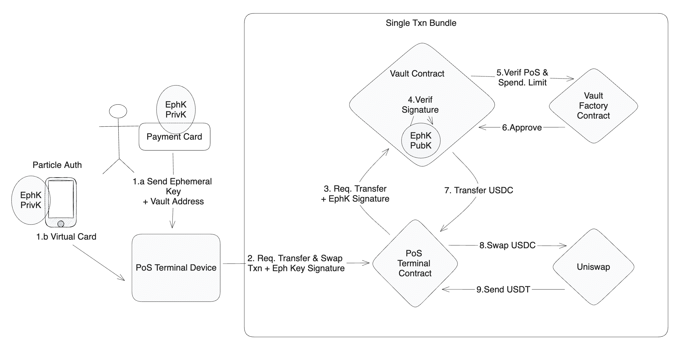

# Bounce

Bounce offers P2P non-custodial NFC card payments with PoS (Point-of-Sale) terminals. Deployed and working on Light Link Network. Our application also leverages Uniswap v2 to make trades

Bounce represents an innovative decentralized and non-custodial solution for facilitating peer-to-peer payments, underpinned by immutable smart contracts within the blockchain. It is worth noting that the act of effecting real-world fiat purchases using physical payment cards, often through intermediaries like Mastercard or Visa, has become ubiquitous. Nevertheless, the realm of cryptocurrency payments has hitherto lacked an effective, proficient, or truly compelling solution.

It is imperative to initially delineate the two primary components that most individuals would naturally contemplate when envisioning the establishment of an underlying infrastructure for this endeavor: the NFC card and the Point of Sale (PoS) terminal. The initial conceptualization, perhaps the most straightforward one (in the absence of security concerns), would involve the storage of an Externally Owned Account's (EOA) private key on the NFC card. Subsequently, a PoS terminal would be configured to receive this private key upon tapping the card on a reader. In this scenario, the terminal would propose an incompletely processed transaction, which the private key would validate and transmit to the blockchain.

Navigating this challenge without considering security is, indeed, a relatively uncomplicated task. However, as soon as security considerations enter the equation, the complexity of the issue escalates significantly.

The solution encompasses the introduction of two pivotal fundamental components into the system. First and foremost, a vault, serving as a centralized repository for users to safeguard their funds, comes into play. Second, an ephemeral mechanism is employed to address the intricate security concerns that arise in the execution of this concept.

## Structure

This monorepo contains 4 subrepos each playing a crucial role for the application to work:

- `smart-contracts` - bootstrapped with hardhat with ethers. It is used to build the contracts and manage deployments on mode.
- `pos-terminal` - browser-dapp running on the PoS device to handle transaction payments for a retailer. It utilises Ethers to emit transactions to the mode network
- `hardware-server` - runs a local endpoint that feeds nfc cards read by a local reader to the pos-terminal dapp
- `mobile_app` - a react native app supporting ios and android devices. It can be used to manage user's vault and also carry out NFC payments directly from the smartphone to the PoS terminal



## Contracts

All contracts are deployed to testnet and verified on blockscout:

- `Vault Contract`: [0x8fbD84BB0f621d23A8B5D9CD630dA2CAA793a4D4](https://testnet.snowtrace.io/address/0x8fbD84BB0f621d23A8B5D9CD630dA2CAA793a4D4/contract/43113/code)
  - Holds user funds and tokens can only be transferred out with valid ephemeral key on the nfc card and whitelisted PoSTerminal addresses
  - Instance of a vault contract deployed owned by a user
- `VaultFactory Contract`: [0x1482B1D35C939CA6a2D5869eB0CEcB295737DA3D](https://testnet.snowtrace.io/address/0x1482B1D35C939CA6a2D5869eB0CEcB295737DA3D/contract/43113/code)
  - Allows new users to deploy their own vaults.
  - Stores valid PoS Terminal addresses managed by owners
- `POSTerminal Contract`: = [0x4543C34e15Ac96DaB7807213ff206bde3505B981](https://testnet.snowtrace.io/address/0x4543C34e15Ac96DaB7807213ff206bde3505B981)
  - Contracts owned by approved retailers that can accept payments from Vault contracts through transactions approved with the ephemeral key
  - Programmable bundled transactions. Upon nfc card payments extra steps can be composed to do swaps on a DEX or integrate with any other on-chain contract

We have also deployed Uniswap V2 Forks on the following addresses:

- `UniswapV2Factory`: [0xc52906e10676c36FD26dA737661485f8cfE8EcD1](https://testnet.snowtrace.io/address/0xc52906e10676c36FD26dA737661485f8cfE8EcD1)
- `Router02`: [0xEc9834645630683C824c6CfE2475C1fE67e5931c](https://testnet.snowtrace.io/address/0xEc9834645630683C824c6CfE2475C1fE67e5931c)

## Pre-requisites

- [Node 18+ and NPM](https://docs.npmjs.com/downloading-and-installing-node-js-and-npm)
- NFC card reader
- NFC cards

## Quick-Start

1. Deploying Contracts

   a. Navigate to `smart-contracts` directory

   ```bash
   cd ./contracts
   ```

   b. Setup `.env` files with private key as shown in `.env.example`

   c. Install dependencies

   ```bash
   npm install
   ```

   d. Deploy `VaultFactory` & `Vault` & `POSTerminal` contracts with hardhat deploy

   ```bash
   npx hardhat run scripts/deploy.ts --network light-link
   ```

2. Run `nfc-reading-server` in the background:
   a. Connect nfc card reader to the device
   b. Navigate to `nfc-reading-server`

   ```bash
   cd ../nfc-reading-server
   ```

   c. Install dependencies

   ```bash
   npm install
   ```

   d. run

   ```bash
   node index.js
   ```

3. Run `pos-terminal`:
   a. Navigate to `pos-terminal`
   b. Setup `.env` files with private key as shown in `.env.example`.

   ```bash
   cd ../pos-terminal
   ```

   c. Install dependencies

   ```bash
   npm install
   ```

   d. Run the application

   ```bash
   npm run start
   ```
